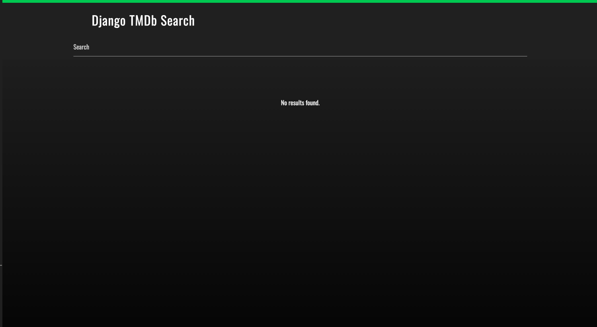
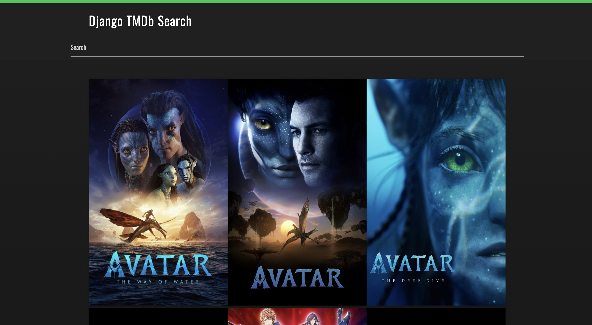
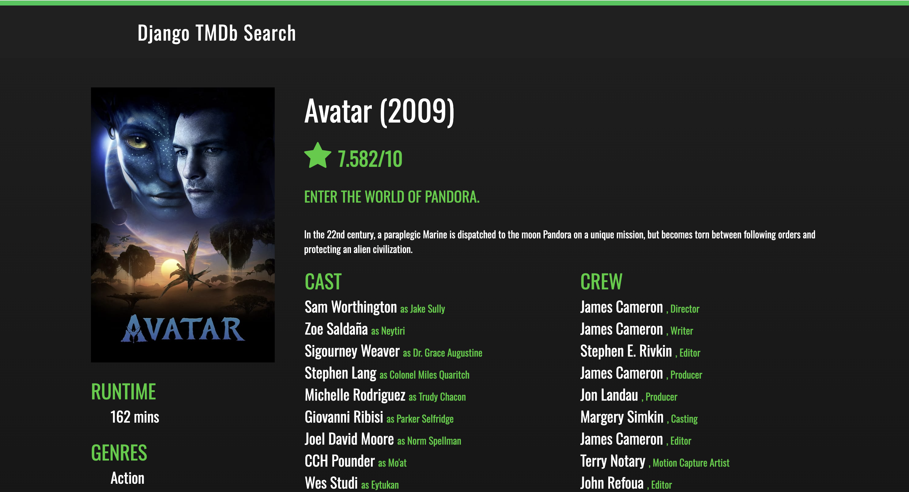
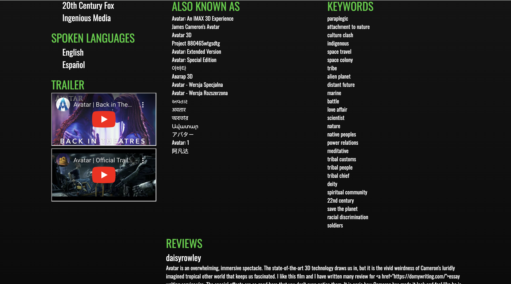

# Movie search
An website for movie search

The home page looks like:


After search, a grid of posters appear:


And when clicking into the poster, we can see the detail of the movie:



# Install dependency
```bash
conda create --name django-tmdb python=3.7.1
pip install -r requirements.txt
conda activate django-tmdb
```

# Run Django project
```python
python manage.py migrate
python manage.py runserver
```

# Design
## API selection
TMDB is selected as there is a convenient python library called tmdbsimple.
## API integration
Django is chosen as I'm more familiar with Django.
## Search functionality
Use tmdbsimple library:
```python
search_result = tmdb.Search().movie(query=query)['results']
movie = tmdb.Movies(id)
```
## Data processing and filtering
Return json query result from API.
```python
frontend = {
    "search_result": sorted(search_result, key=lambda x: x['popularity'], reverse=True),
    "has_result": (search_result != [])
}
frontend = {
    "info": movie.info(),
    "year": movie.info()['release_date'][:4],
    "cast": movie.credits()['cast'][:15],
    "crew": movie.credits()['crew'][:15],
    "trailers": trailers,
    "teasers": teasers,
    "keywords": keywords,
    "reviews": movie.reviews()['results'],
    "alt": movie.alternative_titles()['titles']
}
```
## Data presentation
Query result is rendered by HTML and javascript.
```python
return render(request, "movie.html", frontend)
return render(request, "details.html", frontend)
```

## Encrypt
For tmdb api key and Django secret key, python-decouple is used. Keys are stored in .env file.

## Cache
Use Django-redis for cache.
```
given a URL, try finding that page in the cache
if the page is in the cache:
    return the cached page
else:
    generate the page
    save the generated page in the cache (for next time)
    return the generated page
```